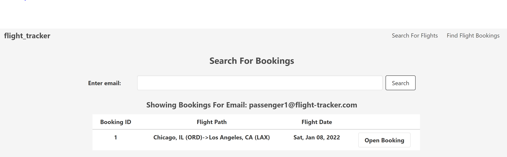

# Flight Tracker
## Description
This is a project based off the prompt from [The Odin Ruby on Rails Learning Track](https://www.theodinproject.com/paths/full-stack-ruby-on-rails/courses/ruby-on-rails/lessons/flight-booker). The project is to set up a flight search and registration. 

## Live Preview 
You can see a live version of this project [here](https://odin-flight-tracker.herokuapp.com/). You can search for upcoming flights for the first half of Jan/2022.

## Functionality

Search for one way tickets between any of the 9 supported airports. Select the amount of passengers and the desired date.

Initial flight search will generate a table with all matching flights with the option to select a desired flight.

Once a flight is selected this form will be generated with the flight details and sections to enter in passenger information. 

Once booking is confirmed a summary of the passengers and flights are displayed.

The site also supports searching for bookings by passenger emails. This search will allow you to open the summary for that reservation.