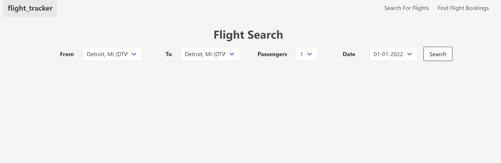
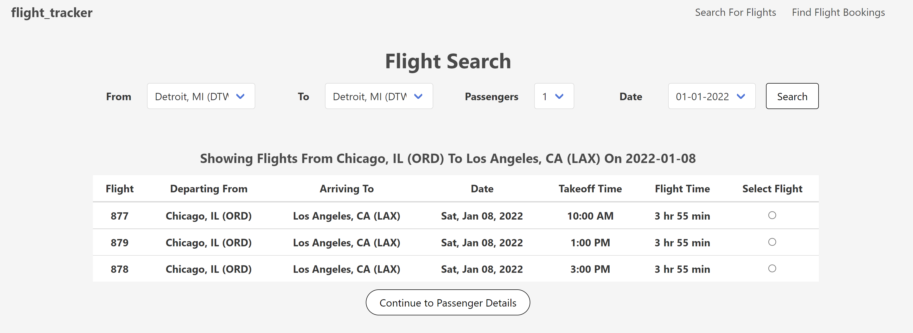
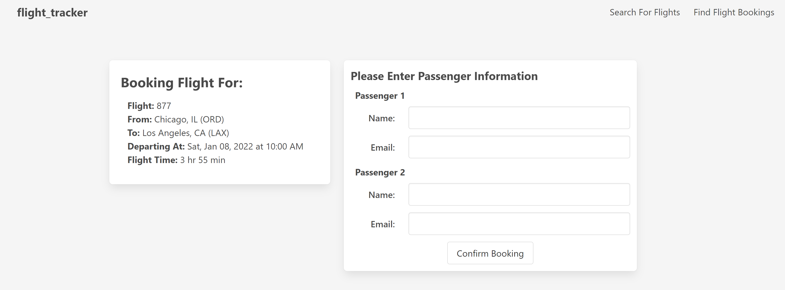
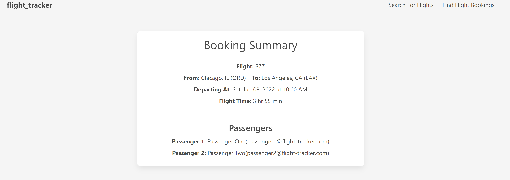

# Flight Tracker
## Description
This is a project based off the prompt from [The Odin Ruby on Rails Learning Track](https://www.theodinproject.com/paths/full-stack-ruby-on-rails/courses/ruby-on-rails/lessons/flight-booker). The project is to set up a flight search and registration. 

## Live Preview 
You can see a live version of this project [here](https://odin-flight-tracker.herokuapp.com/). You can search for upcoming flights for the first half of Jan/2022.

## Functionality

